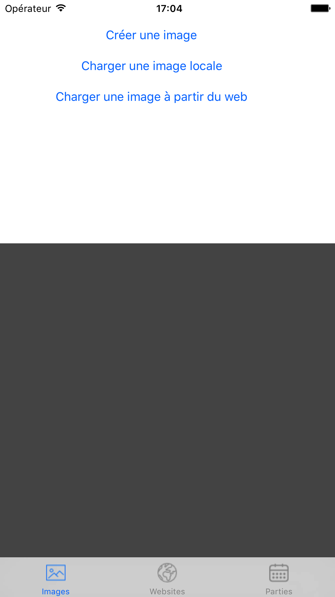
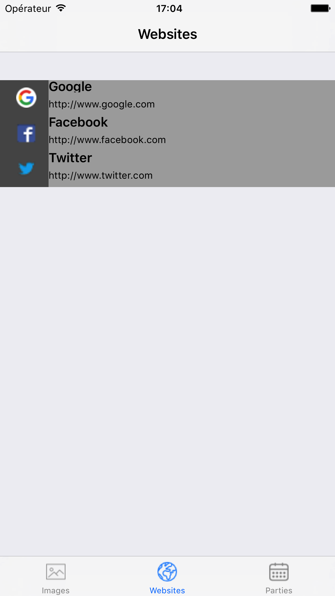
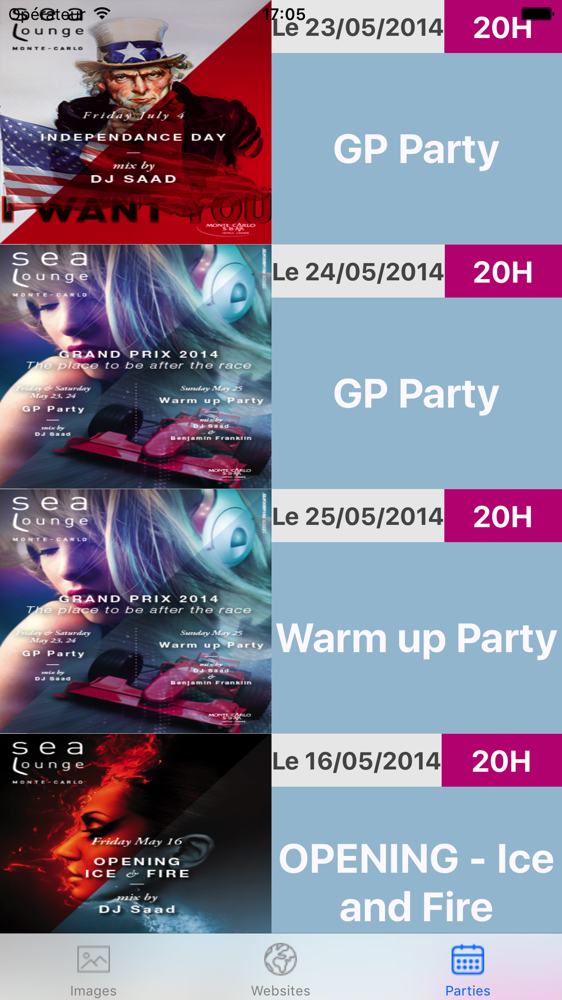

# tp_web_ios
Application qui permet de:
- Gérer une visionneuse d'image qui gère l'affichage d'image locale et distante.
- Gérer une liste de sites internet et d'y récupérer leur contenu.
- Gérer l'affichage d'événements grâce à un fichier XML distant.

Utilisation avancée des cellules.

# Screenshots

## Page d'accueil / Ajout d'image locale et externe

## Gestion de sites internet

## Affichage d'un site internet

## Affichage d'un tableau avec événements

